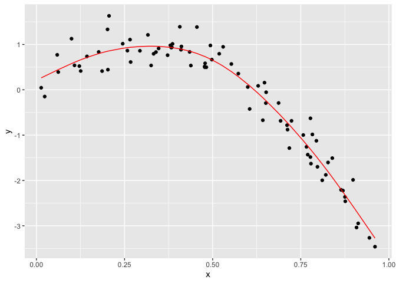

cross\_validation
================
Lu Chen
11/12/2019

``` r
nonlin_df = 
  tibble(
    id = 1:100,
    x = runif(100, 0, 1),
    y = 1 - 10 * (x - .3) ^ 2 + rnorm(100, 0, .3)
  )

nonlin_df %>% 
  ggplot(aes(x = x, y = y)) + 
  geom_point() + theme_bw()
```


``` r
train_df = sample_n(nonlin_df, 80)
test_df = anti_join(nonlin_df, train_df, by = "id")

ggplot(train_df, aes(x = x, y = y)) + 
  geom_point() + 
  geom_point(data = test_df, color = "red")
```

 Fit three models for varying goodness.

``` r
linear_mod = lm(y ~ x, data = train_df)
smooth_mod = mgcv::gam(y ~ s(x), data = train_df)
wiggly_mod = mgcv::gam(y ~ s(x, k = 30), sp = 10e-6, data = train_df)
```

Let's look at some fits

``` r
train_df %>% 
  add_predictions(linear_mod) %>% 
  ggplot(aes(x = x, y = y)) +
  geom_point() +
  geom_line(aes(y=pred), color = "red")
```

 Better fit with smooth curve

``` r
train_df %>% 
  add_predictions(smooth_mod) %>% 
  ggplot(aes(x = x, y = y)) +
  geom_point() +
  geom_line(aes(y=pred), color = "red")
```



try wiggly curve

``` r
train_df %>% 
  add_predictions(wiggly_mod) %>% 
  ggplot(aes(x = x, y = y)) +
  geom_point() +
  geom_line(aes(y=pred), color = "red")
```


testing which is best

``` r
rmse(linear_mod, test_df) #0.705
```

    ## [1] 0.7052956

``` r
rmse(smooth_mod, test_df) #0.222 -> best fit among three curves
```

    ## [1] 0.2221774

``` r
rmse(wiggly_mod, test_df) #0.289
```

    ## [1] 0.289051

Do this all using `modelr` package
----------------------------------

``` r
cv_df = 
  crossv_mc(nonlin_df,100) #crossc_mc: generate testing-training paris for cross-validation
```

one note about resample

``` r
cv_df %>% pull(train) %>% .[[1]] %>% as_tibble
```

    ## # A tibble: 79 x 3
    ##       id      x       y
    ##    <int>  <dbl>   <dbl>
    ##  1     1 0.266   1.11  
    ##  2     2 0.372   0.764 
    ##  3     3 0.573   0.358 
    ##  4     4 0.908  -3.04  
    ##  5     6 0.898  -1.99  
    ##  6     7 0.945  -3.27  
    ##  7     8 0.661  -0.615 
    ##  8     9 0.629   0.0878
    ##  9    10 0.0618  0.392 
    ## 10    11 0.206   1.63  
    ## # … with 69 more rows

``` r
#pulling out the first dataset in training as a dataframe
```

``` r
cv_df =
  cv_df %>% 
  mutate(
    train = map(train, as_tibble),
    test = map(test, as_tibble)
  )
```

``` r
cv_df %>% 
  mutate(
    linear_mods = map(.x = train, ~lm(y~x, data = .x)),
    rmse_lin = map2(.x = linear_mods, .y = test, ~rmse(.x,.y))
  )
```

    ## # A tibble: 100 x 5
    ##    train             test              .id   linear_mods rmse_lin 
    ##    <list>            <list>            <chr> <list>      <list>   
    ##  1 <tibble [79 × 3]> <tibble [21 × 3]> 001   <lm>        <dbl [1]>
    ##  2 <tibble [79 × 3]> <tibble [21 × 3]> 002   <lm>        <dbl [1]>
    ##  3 <tibble [79 × 3]> <tibble [21 × 3]> 003   <lm>        <dbl [1]>
    ##  4 <tibble [79 × 3]> <tibble [21 × 3]> 004   <lm>        <dbl [1]>
    ##  5 <tibble [79 × 3]> <tibble [21 × 3]> 005   <lm>        <dbl [1]>
    ##  6 <tibble [79 × 3]> <tibble [21 × 3]> 006   <lm>        <dbl [1]>
    ##  7 <tibble [79 × 3]> <tibble [21 × 3]> 007   <lm>        <dbl [1]>
    ##  8 <tibble [79 × 3]> <tibble [21 × 3]> 008   <lm>        <dbl [1]>
    ##  9 <tibble [79 × 3]> <tibble [21 × 3]> 009   <lm>        <dbl [1]>
    ## 10 <tibble [79 × 3]> <tibble [21 × 3]> 010   <lm>        <dbl [1]>
    ## # … with 90 more rows

``` r
cv_df = 
  cv_df %>% 
  mutate(linear_mod  = map(train, ~lm(y ~ x, data = .x)),
         smooth_mod  = map(train, ~mgcv::gam(y ~ s(x), data = .x)),
         wiggly_mod  = map(train, ~gam(y ~ s(x, k = 30), sp = 10e-6, data = .x))) %>% 
  mutate(rmse_linear = map2_dbl(linear_mod, test, ~rmse(model = .x, data = .y)),
         rmse_smooth = map2_dbl(smooth_mod, test, ~rmse(model = .x, data = .y)),
         rmse_wiggly = map2_dbl(wiggly_mod, test, ~rmse(model = .x, data = .y)))
```

``` r
cv_df %>% 
  select(starts_with("rmse")) %>% 
  pivot_longer(
    everything(),
    names_to = "model", 
    values_to = "rmse",
    names_prefix = "rmse_") %>% 
  mutate(model = fct_inorder(model)) %>% 
  ggplot(aes(x = model, y = rmse)) + geom_violin()
```


child growth
------------

``` r
child_growth = read_csv("nepalese_children.csv")
```

    ## Parsed with column specification:
    ## cols(
    ##   age = col_double(),
    ##   sex = col_double(),
    ##   weight = col_double(),
    ##   height = col_double(),
    ##   armc = col_double()
    ## )

``` r
child_growth %>% 
  ggplot(aes(x = weight, y = armc)) + 
  geom_point(alpha = .5)
```


